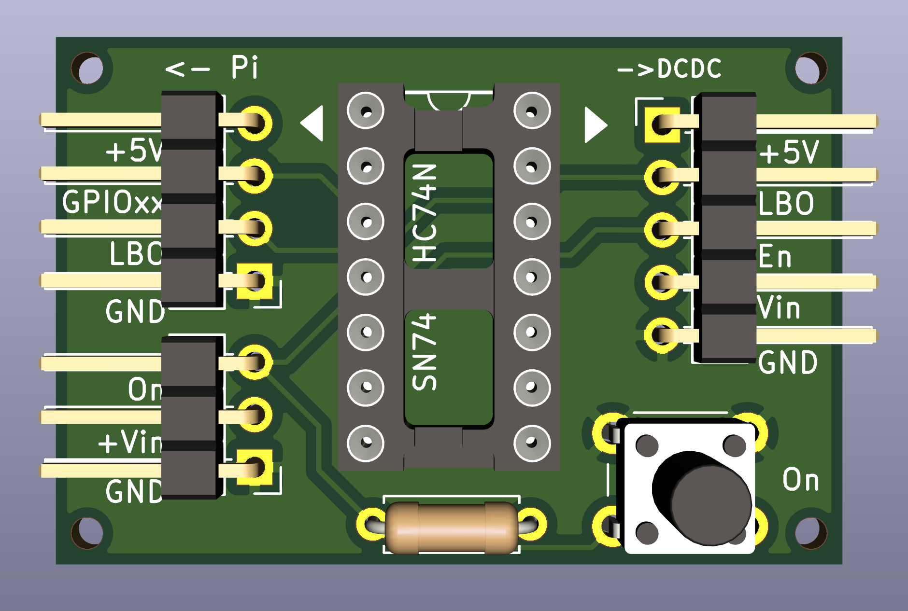
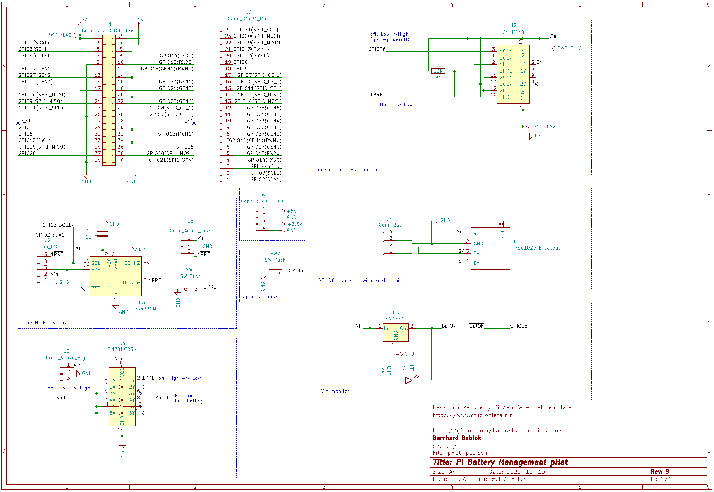

A pcb to support the battery management of mobile Pi-projects
=============================================================

Overview
--------

Since the Pi still drains power after shutdown, it is necessary
for battery-based projects to turn of the supply. This project uses
a very simple design to implement this.

One requisite is a DCDC-converter with an enable pin. As an alternative,
you can use a mosfet to switch power.

This repository contains two pcbs: the so called
_"minimal pcb"_ is nothing more than a flip-flop (SN74HC(T)74) with some
connectors for the converter and the Pi. The second pcb is a pHat designed
for a Pi-Zero.

Schematic Min-PCB
-----------------

The flip-flop drives the enable pin of the converter (pin 1Q). A button
(and/or RTC or sensor) pulls the reset pin (/1PRE) low to turn on power. A
GPIO from the Pi is connected to the clock-pin (pin 1CLK). The Pi will
pull this pin high on shutdown (see below). This will change the state
of the flip-flop: 1Q will take the value of 1D, which in turn is
connected to the inverted value /1Q (i.e. 1Q will switch to the current
value of /1Q).

The additional pin labelled _"LBO"_ is optional. Converters with a battery
monitoring can output a signal (_"low battery out"_) and if this is
connected to the Pi a program can react e.g. with an emergency
shutdown or an alarm if LBO is set.

Min-Pcb
-------

This is a very small pcb, useful if your project design needs it near
the battery pack:

The layout is simple and the complete kicad-project is available in the
directory `min-pcb`.

Schematic pHat-Pcb
------------------

This circuit is more sophisticated. The basis is the same, but it adds an
RTC (DS3231) for time-based boots and an inverter, mainly for turning on
power with a low-high transition. Also, the pcb has space for a
TPS61023 breakout (DC-DC converter) and for a KA75330 voltage-supervisor IC.

If you populate a LED+resistor, it will light up once the input
voltage drops below something like 3.15-3.45V (range of KA75330 according
to the datasheet). But in fact it might be a better idea not to
populate these two components: if voltage is low you don't want to
waste the rest of the battery for lighting up a LED?! For this reason
the inverted signal is also connected to GPIO16, so the Pi can react
and maybe shutdown or send a low-battery mail.

Another optional component is a second switch, directly attached to the Pi
(GPIO6). See the configuration section below to see how you can
shutdown the Pi with this button (you can use it for other purposes as well).

pHat-Pcb
--------

The format of the pcb is a zero-sized hat without beeing a formal pHat:

The hat breaks out most of the GPIOs, except for GPIO6, GPIO16 and GPIO26.

The following components are optional:

  - TPS61023 DC-DC converter
    (you can externaly connect battery, 5V and enable pin instead)
  - DS3131 RTC
  - KA75330 + LED + resistor
  - all connectors

Pi Configuration Min-Pcb
------------------------

The Pi has to signal shutdown to the pcb. Simply add the following
line to your `/boot/config.txt`:

    dtoverlay=gpio-poweroff,gpiopin=26

Note that the default is GPIO26 (physical pin 37). You cannot
just use any pin, since on power-on the pin has to be pulled low
until the gpio-poweroff driver takes over.

Pi Configuration pHat-Pcb
-------------------------

This pcb has multiple connections to the Pi. Add following lines to
your `/boot/config.txt`:

    dtoverlay=i2c-rtc,ds3231,wakup-source
    dtoverlay=gpio-shutdown,gpio_pin=6
    dtoverlay=gpio-poweroff,gpiopin=26
    dtoverlay=gpio-key,gpio=16,active_low=0,gpio_pull=off,label=lbo,keycode=xx

The first line is to activate the rtc, the last line triggers the
configured key on a battery low signal. This is just an example, there
are other ways to monitor GPIO16 for a low-high transition.

For the rtc you need an additional file `/etc/udev/rules.d/85-hwclock.rules`
with the content:

    KERNEL=="rtc0", RUN+="/sbin/hwclock -s -u -f $root/$name"
